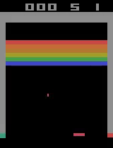

# DQN Atari model
---
- Dueling (advantage and value heads)
- Delayed target model
- Expeirence replay taken from [`Howuhh/prioritized_experience_replay`](https://github.com/Howuhh/prioritized_experience_replay) (modified a bit)
- Epsilon-greedy with linear decay
- 10 hours training, over 30 mean score per life
---

